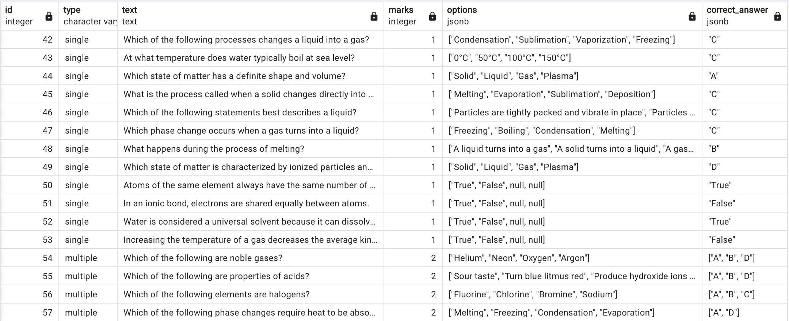

# Project 8

Update project 5 to support different types of questions. Questions can be 1) Subjective type with long answers, Objective type with a True/False or Objective type with multiple answer choices.

* Support an interface that takes a Question and stores it.

* Use inheritance to support different types of questions being stored by the implementation of the interface

## Example:

    Q1 - Earth is round
        True
        False

    Q2 - What are is the color of a leaf typically
        Red
        Blue
        Green
        White

    Q3 - Describe the properties of steel

## Requirements
* Implement using the OOPs concepts

## Error Handling
* As per project 5

# How to Run?
./run.sh

# Design

1. Question interface

    - Defines the contract for all questions.

    - Common methods might be:

        get_text() → returns the question statement

        get_marks() → returns marks/weightage

        evaluate(answer) → evaluates an answer and returns score/result

2. Evaluator interface

    - Defines how to evaluate: evaluate(question, answer) → score.

    - Different implementations handle different rules.

3. Concrete Evaluators

    - SingleOptionEvaluator → compares one correct option.

    - MultipleOptionsEvaluator → handles multiple correct answers, maybe partial credit.

    - DescriptiveEvaluator → keyword matching, rubric-based, or always returns “pending manual evaluation”.

4. Composition

    - Each Question holds a reference to an Evaluator.

    - When evaluation is needed, the system calls:

## Question Hierarchy

```text
Question
│
├── ObjectiveQuestion
│   ├── SingleOptionQuestion
│   │   └── TrueFalseQuestion
│   ├── MultipleOptionsQuestion
│   └── MatchTheFollowingQuestion
│
└── DescriptiveQuestion

## Evaluator Hierarchy

Evaluator
│
├── SingleOptionEvaluator
│   └── TrueFalseEvaluator
├── MultipleOptionsEvaluator
├── MatchTheFollowingEvaluator
└── DescriptiveEvaluator

## Question → Evaluator Mapping

| Question Type                 | Evaluator Type                | Notes                                                |
|-------------------------------|-------------------------------|------------------------------------------------------|
| SingleOptionQuestion          | SingleOptionEvaluator         | Generic single-answer questions.                     |
| TrueFalseQuestion             | TrueFalseEvaluator*           | Specialization of single-option (can reuse single).  |
| MultipleOptionsQuestion       | MultipleOptionsEvaluator      | Supports multiple correct answers, partial credit.   |
| MatchTheFollowingQuestion     | MatchTheFollowingEvaluator    | Evaluates correct pairings, partial marks possible.  |
| DescriptiveQuestion           | DescriptiveEvaluator          | Free-text; may require manual or NLP-based grading.  |

\* `TrueFalseEvaluator` could just delegate to `SingleOptionEvaluator`, but is kept separate for clarity/extension.
```

## Database Tables

-- project8: table-per-subclass approach

-- Base table (all questions)

CREATE TABLE base_question (
    id SERIAL PRIMARY KEY,

    type VARCHAR(50) NOT NULL,   -- "single", "multi", "match", "truefalse", "descriptive"

    text TEXT NOT NULL,

    marks INT NOT NULL
);


-- Objective questions (Single | Multi | Match | TrueFalse)
CREATE TABLE objective_question (
    id INT PRIMARY KEY REFERENCES base_question(id) ON DELETE CASCADE,

    options JSONB NOT NULL,

    correct_answer JSONB NOT NULL
);


-- Descriptive questions

CREATE TABLE descriptive_questions (

    id INT PRIMARY KEY REFERENCES base_question(id) ON DELETE CASCADE,

    keywords JSONB
);

## Database Data

Data Joining `base_question` & `objective_question` - Contains single & multiple options answer

